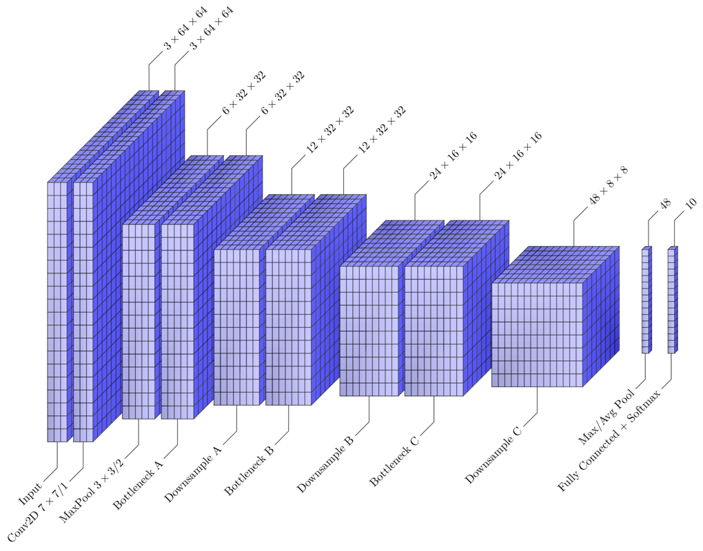

# tikz-networks


This library provides a set of commands that simply the creation of
Tikz figures representing convolutional neural networks. This project
is still a work in progress.



## Intro

The drawing of 3D tensors is based on a generic approach for drawing
cuboids found [here.](https://tex.stackexchange.com/questions/29877/need-help-creating-a-3d-cube-from-a-2d-set-of-nodes-in-tikz)
Wrappers are provided that augment the default cuboid drawing options
as is appropriate for 3D and 2D tensors. A labeling mechanism is also
provided.


## Todo

 1. This approach is slow for larger networks. It may be useful to
		tweak the default grid density to reduce the number of drawn
		paths.
 2. Implement a parameterized way to draw and space layers. The
		provided example could likely be simplified to just a few lines
		with elegant use of `\foreach` loops.


## Usage

See [example.tex](examples/example.tex) for a complete usage example.

Layer drawings are done using the `\veclayer` or `\cnnlayer` commands.
The former provides defaults suitable for "vector" layers, while the
latter provides defaults for 3D tensors. Both commands are wrappers
over the generic `\tikzcuboid` command.

### Scale

Scale adjustments are best made as follows

```latex
\begin{tikzpicture}[scale=0.5, every node/.style={scale=0.5}]
	...
\end{tikzpicture}
```

### Keys

The following `tikzset` keys are available

```latex
\tikzset{
  shiftx/.initial=0,
  shifty/.initial=0,
  dimx/.initial=3,
  dimy/.initial=3,
  dimz/.initial=3,
  scale/.initial=1,
  densityx/.initial=1,
  densityy/.initial=1,
  densityz/.initial=1,
  rotation/.initial=0,
  anglex/.initial=0,
  angley/.initial=90,
  anglez/.initial=225,
  scalex/.initial=1,
  scaley/.initial=1,
  scalez/.initial=0.5,
  front/.style={draw=black,fill=white},
  top/.style={draw=black,fill=white},
  right/.style={draw=black,fill=white},
  shade=false,
  shadecolordark/.initial=black,
  shadecolorlight/.initial=white,
  shadeopacity/.initial=0.15,
  shadesamples/.initial=16,
  emphedge=false,
  emphstyle/.style={thick},
  label/above=false,
  label/above/text,
  label/above/y/.initial=5,
  label/above/z/.initial=3,
  label/below=false,
  label/below/y/.initial=5,
  label/below/z/.initial=3,
  label/below/text,
  label/.style={rotate=45}, % Label text style
  label/path/.style={draw, -}, % Label line style
}
```
